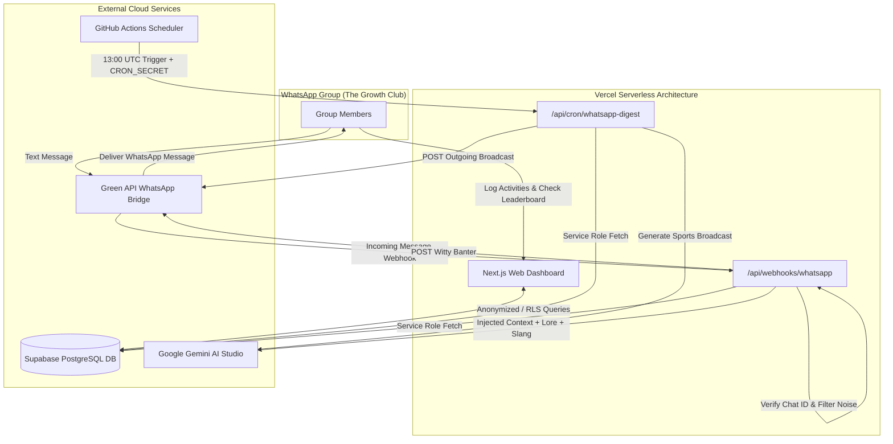

# Beyond Yesterday: The Growth Club

<p align="center">
  
  
  
  
  
</p>

---

## 🎯 The Growth Club Philosophy
**Beyond Yesterday** is a mobile-first workout tracking and competitive dashboard built for friend groups, sports clubs, teams, and families. It empowers members to log activities, view real-time scores, and compete on a dynamic leaderboard. 

To prevent slacking, it integrates **Fisky**—an automated, AI-driven WhatsApp banter agent speaking in *Classy Urban Hyderabadi Telugu* slang that sends morning sports broadcasts, roasts inactive users, and responds to real-time chat banter directly inside the WhatsApp group.

---

## 🚀 Key Systems & Architecture

### 1. PIN-Based Authentication Scoping (Kiosk Auth)
- The app operates on a "Kiosk Auth" model. Users enter a personal 4-digit PIN matched against their profile within a specific group.
- **Session Scoping:** Successful login decodes and sets an HTTP-only secure cookie `app_session` storing the `userId` and `groupId`. All queries and mutations are dynamically scoped to this session's `groupId` to enforce tenancy boundaries.

### 2. Dual-Mode Activity Logging Engine
- **AI Assist Mode:** Powered by Google Gemini. Extracts structured `{ metric_slug, value, unit }` from freeform natural language text (e.g. *"Ran 5.2 miles in 45m"*).
- **Manual Log Mode:** Default structured forms. Supports standard numerical metrics and endurance/time-based metrics (which render a distance field and a structured duration picker). Total seconds are compressed and appended to the comment block.

### 3. Targeted Peer-Review Verification Lifecycle
- **Everyday Auto-Verification:** Basic logging metrics (such as `highest_steps`, `marathon`, `catan_wins`, etc.) bypass the voting queue and auto-verify to `'verified'` immediately upon insertion.
- **Extreme Feats Gate:** High-profile logs (`car_top_speed` and `most_beers`) are inserted with `status = 'pending'`.
- **Peer Voting:** Pending logs require **3 approvals** from other group members to transition from `'pending'` to `'verified'` (which triggers XP rewards). Peer approvals are logged in the `log_votes` table.

### 4. Wearables Auto-Sync Engine & Google Fit Integration
- **Google Fit integration:** End-to-end OAuth flow (`/api/wearables/connect/google` and `/api/wearables/callback/google`) linking Google accounts to profile rows, saving the `refresh_token` securely.
- **Automated Sync Cron:** Runs via `/api/cron/sync-wearables`. Refreshes access tokens and aggregates steps, sleep hours, and resting heart rates into the database, setting them directly to `'verified'` to update scoreboard states.

---

## 👑 Admin Settings & Console

When unlocked with the master password PIN, the Admin Settings tab exposes powerful controls for managing group metrics, users, and AI parameters:

- **AI Tone Dispatcher:** Trigger a custom broadcast to the WhatsApp group. Select a target member, choose a tone vibe (Ragebait, Fun-Roast, Sarcastic, Praise, Flirt, Motivate), select a gender style override (Auto, Male, Female, Gay), inject situational text, and dispatch immediately.
- **Log Editor:** View all recent activity logs for the group, filter by member or metric type, search captions, edit log values, manually verify pending logs, or permanently delete log entries.
- **AI Brain Editor:** Adjust the AI's core banter engine through custom inputs:
  - **Member Lore:** Upsert user-specific traits, good/bad habits, catchphrases, and select their personal gang nemesis (opponent) for personalized LLM roasts.
  - **Vocabulary Banks:** Define tone-specific and target-gender routed slang words (e.g. Hyderabad colloquialisms) that the AI dynamically pulls from to inject mass-appeal banter.
- **Manage Users (Soft Delete Engine):** View all active members. Support deactivating/reactivating profiles (Soft Hide) to hide them from list directories and leaderboards, or permanently deleting profiles from the database (Hard Drop).
- **Metric Definitions Manager:** View, edit, hide, or delete active metrics tracked by the team. Toggling unhide/hide updates dashboard computations in real-time.

---

## 🗺️ High-Level System Architecture



---

## 📊 Database Schema (Supabase PostgreSQL 15)

### Core User Directory
- **`groups`:** `id` (UUID PK), `name` (text), `invite_code` (text unique), `created_at` (timestamptz).
- **`profiles`:** `id` (UUID PK), `full_name` (text), `nickname` (text), `email` (text), `pin` (varchar 4), `avatar_url` (text), `total_xp` (int), `current_level` (int), `is_active` (boolean default true), `created_at` (timestamptz).
- **`group_members`:** `user_id` (UUID FK), `group_id` (UUID FK), `role` (text default 'member'), `joined_at` (timestamptz). *Composite PK: (user_id, group_id).*

### Activity & Ingestion
- **`metric_definitions`:** `id` (UUID PK), `name` (text), `unit` (text), `sort_direction` (text), `group_id` (UUID FK), `is_hidden` (boolean default false), `created_at` (timestamptz).
- **`metric_logs`:** `id` (UUID PK), `user_id` (UUID FK), `group_id` (UUID FK), `metric_slug` (text), `value` (numeric), `unit` (text), `status` (text pending|verified|rejected), `evidence_url` (text), `caption` (text), `logged_at` (timestamptz).
- **`log_votes`:** `id` (UUID PK), `log_id` (UUID FK), `user_id` (UUID FK), `cast_at` (timestamptz). *Unique constraint: (log_id, user_id).*

### AI Brain & Persona Customization
- **`member_lore`:** `user_id` (UUID PK references profiles), `stunts` (text array), `good_habits` (text array), `bad_habits` (text array), `ego_trigger` (text), `catchphrase` (text), `nemesis_id` (UUID FK references profiles).
- **`vocab_banks`:** `id` (UUID PK), `tone` (text), `target_gender` (text), `words` (text array). *Unique constraint: (tone, target_gender).*
- **`chat_history`:** `id` (UUID PK), `group_id` (UUID FK), `role` (text), `sender_name` (text), `content` (text), `created_at` (timestamptz).

### Wearables Data Integration
- **`wearable_connections`:** `id` (UUID PK), `user_id` (UUID FK unique), `provider` (text), `access_token` (text), `refresh_token` (text), `token_expires_at` (timestamptz), `last_synced_at` (timestamptz), `created_at` (timestamptz).
- **`wearable_steps`:** `id` (UUID PK), `connection_id` (UUID FK), `logged_date` (date unique), `value` (int), `updated_at` (timestamptz).
- **`wearable_sleep`:** `id` (UUID PK), `connection_id` (UUID FK), `logged_date` (date unique), `value` (numeric), `updated_at` (timestamptz).
- **`wearable_resting_hr`:** `id` (UUID PK), `connection_id` (UUID FK), `logged_date` (date unique), `value` (int), `updated_at` (timestamptz).

---

## 🎨 UI/UX Design System Standard

The dashboard adheres to a strict, modern design clone of the **Wearables Tab** color palette and typography rules:

- **Canvas Background:** Light mode off-white (`#F7F8FA` or `#FBFBFB`).
- **Dashboard & Console Cards:** Pure white card surfaces (`#FFFFFF`) with thin gray outlines (`border-slate-200`) and slight box shadows. Dark card containers are completely banned.
- **Primary Highlights & Active Toggles:** Neon Yellow/Green color accent (`#CEFF00`) with dark slate typography.
- **Core Typography:** Dark slate colors (`text-slate-900`) for high contrast bold headers and gray subtitles (`text-slate-500`) for muted text descriptions.

---

## 🛠️ Technology Stack
- **Frontend & Routing:** Next.js 16 (App Router, Turbopack) with `swr` caching
- **Database:** Supabase Cloud (PostgreSQL 15, RLS, pg_cron)
- **AI Processing:** Google Gemini via Vercel AI SDK
- **Data Visualization:** Apache ECharts (`echarts-for-react`)
- **Styling:** Tailwind CSS (v4 with PostCSS inline theme mapping)

---

## 💻 Local Development Workflow

### 1. Install dependencies
```bash
npm install
```

### 2. Configure Environment Variables
Create a `.env.local` file from the provided template:
```bash
cp .env.local.example .env.local
```
Fill in the database, Vercel AI, and Green API tokens as listed in the `.env.local.example` directory.

### 3. Start the dev server
```bash
npm run dev
```
The dashboard is now running at `http://localhost:3000`.
